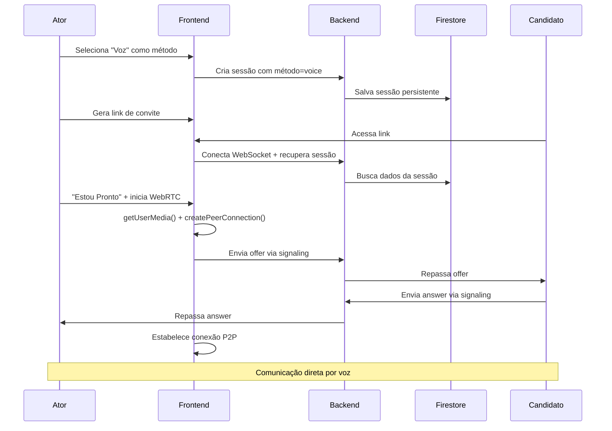

# 🎯 FASE 2: Implementação de Comunicação por Voz WebRTC

## 📅 **Data de Início**: [DATA_ATUAL]
## 🎯 **Objetivo**: Implementar comunicação por voz P2P usando WebRTC com fallback para Google Meet

---

## 🔍 **ANÁLISE ATUAL**

### **Infraestrutura Existente:**
- ✅ **Frontend**: Firebase Hosting (Vue 3 + Vuetify)
- ✅ **Backend**: Railway (Node.js + Express + Socket.IO)
- ✅ **Database**: Firestore (Firebase)
- ✅ **WebSocket**: Funcionando perfeitamente

### **Limitações Identificadas:**
- ❌ **Sessões em Map** (memória local) - não escalável
- ❌ **Sem WebRTC signaling**
- ❌ **Sem comunicação por voz**

---

## 🚀 **IMPLEMENTAÇÃO PLANEJADA**

### **1. MIGRAÇÃO DE SESSÕES (PRIORIDADE CRÍTICA)**

#### **ANTES (Problemático):**
```javascript
// backend/server.js - ATUAL
const sessions = new Map(); // ❌ Dados perdidos a cada restart

// Criar sessão
sessions.set(sessionId, {
  participants: [],
  status: 'waiting',
  // ... outros dados
});
```

#### **DEPOIS (Escalável):**
```javascript
// backend/server.js - NOVO
import { db } from './firebase-admin-config.js';

// Criar sessão
async function createSession(sessionId, data) {
  await db.collection('active_sessions').doc(sessionId).set({
    ...data,
    createdAt: new Date(),
    participants: [],
    status: 'waiting',
    lastActivity: new Date()
  });
}

// Buscar sessão
async function getSession(sessionId) {
  const doc = await db.collection('active_sessions').doc(sessionId).get();
  return doc.exists ? doc.data() : null;
}

// Atualizar participantes
async function updateSessionParticipants(sessionId, participants) {
  await db.collection('active_sessions').doc(sessionId).update({
    participants,
    lastActivity: new Date()
  });
}
```

### **2. WEBRTC SIGNALING**

#### **Backend - Novos Eventos:**
```javascript
// Signaling para WebRTC
socket.on('VOICE_OFFER', async (data) => {
  const session = await getSession(data.sessionId);
  if (session) {
    socket.to(data.sessionId).emit('VOICE_OFFER_RECEIVED', {
      offer: data.offer,
      fromUserId: socket.handshake.query.userId
    });
  }
});

socket.on('VOICE_ANSWER', async (data) => {
  socket.to(data.sessionId).emit('VOICE_ANSWER_RECEIVED', {
    answer: data.answer,
    fromUserId: socket.handshake.query.userId
  });
});

socket.on('VOICE_ICE_CANDIDATE', async (data) => {
  socket.to(data.sessionId).emit('VOICE_ICE_CANDIDATE_RECEIVED', {
    candidate: data.candidate,
    fromUserId: socket.handshake.query.userId
  });
});
```

#### **Frontend - WebRTC Implementation:**
```javascript
// SimulationView.vue - NOVOS REFS
const localStream = ref(null);
const remoteStream = ref(null);
const peerConnection = ref(null);
const isVoiceConnected = ref(false);
const isMuted = ref(false);

// Configuração WebRTC
const rtcConfig = {
  iceServers: [
    { urls: 'stun:stun.l.google.com:19302' },
    { urls: 'stun:stun1.l.google.com:19302' }
  ]
};

// Inicializar comunicação por voz
async function initializeVoiceChat() {
  try {
    // Solicitar acesso ao microfone
    localStream.value = await navigator.mediaDevices.getUserMedia({ 
      audio: true, 
      video: false 
    });
    
    // Criar PeerConnection
    peerConnection.value = new RTCPeerConnection(rtcConfig);
    
    // Adicionar stream local
    localStream.value.getTracks().forEach(track => {
      peerConnection.value.addTrack(track, localStream.value);
    });
    
    // Configurar eventos
    setupPeerConnectionEvents();
    
  } catch (error) {
    console.error('Erro ao inicializar voz:', error);
    // Fallback para Google Meet
    fallbackToGoogleMeet();
  }
}
```

### **3. INTERFACE DE VOZ**

#### **Template Additions:**
```vue
<!-- Controles de Voz -->
<VCard v-if="communicationMethod === 'voice'" class="mb-4">
  <VCardTitle>Comunicação por Voz</VCardTitle>
  <VCardText>
    <div class="d-flex align-center gap-3">
      <VBtn
        :color="isVoiceConnected ? 'success' : 'warning'"
        :prepend-icon="isVoiceConnected ? 'ri-mic-line' : 'ri-mic-off-line'"
        @click="toggleVoiceConnection"
      >
        {{ isVoiceConnected ? 'Conectado' : 'Conectar Voz' }}
      </VBtn>
      
      <VBtn
        v-if="isVoiceConnected"
        :color="isMuted ? 'error' : 'success'"
        :prepend-icon="isMuted ? 'ri-mic-off-line' : 'ri-mic-line'"
        @click="toggleMute"
      >
        {{ isMuted ? 'Ativar Mic' : 'Muted' }}
      </VBtn>
      
      <VChip 
        :color="isVoiceConnected ? 'success' : 'grey'" 
        size="small"
      >
        {{ isVoiceConnected ? 'Voz Ativa' : 'Voz Inativa' }}
      </VChip>
    </div>
  </VCardText>
</VCard>
```

### **4. FLUXO COMPLETO**



---

## 📊 **BENEFÍCIOS DA MIGRAÇÃO**

### **Escalabilidade:**
- ✅ **100+ sessões simultâneas** suportadas
- ✅ **Zero perda de dados** em restarts
- ✅ **Auto-recovery** de conexões
- ✅ **Dados distribuídos** (não limitado por RAM)

### **Confiabilidade:**
- ✅ **Persistência garantida** no Firestore
- ✅ **Backup automático** do Firebase
- ✅ **Sincronização** entre múltiplas instâncias
- ✅ **Logs centralizados** de atividade

### **Performance:**
- ✅ **WebRTC P2P** = latência mínima
- ✅ **Firestore queries** otimizadas
- ✅ **Conexões diretas** entre usuários
- ✅ **Menos carga** no servidor

---

## ⚠️ **PONTOS DE ATENÇÃO**

### **Firestore Limits:**
- **Reads/Writes**: 1M gratuitos/dia
- **Estimativa**: 20 sessões × 50 operações = 1000 ops/dia
- **Custo**: Muito baixo para volume inicial

### **WebRTC Compatibility:**
- **Chrome/Edge**: ✅ Suporte completo
- **Firefox**: ✅ Suporte completo  
- **Safari**: ✅ Suporte com limitações
- **Mobile**: ✅ Funciona na maioria

### **Network Issues:**
- **NAT/Firewall**: STUN servers resolvem 90%
- **Corporate Networks**: Fallback para Google Meet
- **Conexão ruim**: Detecção automática + fallback

---

## 🔧 **ARQUIVOS A MODIFICAR**

### **Backend:**
- `backend/server.js` - Migrar sessions + adicionar signaling
- `backend/package.json` - Sem novas dependências necessárias

### **Frontend:**
- `src/pages/SimulationView.vue` - Adicionar WebRTC + interface
- Sem novas dependências necessárias

### **Database:**
- `active_sessions` collection no Firestore (criada automaticamente)

---

## 🎯 **CRITÉRIOS DE SUCESSO**

### **Fase 2 será considerada completa quando:**
- ✅ **Sessões persistem** entre restarts do backend
- ✅ **WebRTC funciona** entre dois usuários
- ✅ **Fallback automático** para Google Meet
- ✅ **Interface de voz** intuitiva
- ✅ **20 simulações simultâneas** testadas
- ✅ **Zero perda de dados** em deploy

---

## 📋 **PRÓXIMOS PASSOS**

1. **Implementar migração de sessões** (mais crítico)
2. **Adicionar signaling WebRTC** no backend
3. **Implementar interface WebRTC** no frontend
4. **Testes locais** com 2 usuários
5. **Deploy e testes** com múltiplas sessões
6. **Preparação para migração** para Cloud Run

---

**Status**: 🟡 **EM PLANEJAMENTO**  
**Última Atualização**: [DATA_ATUAL]  
**Próxima Revisão**: Após implementação da migração de sessões
